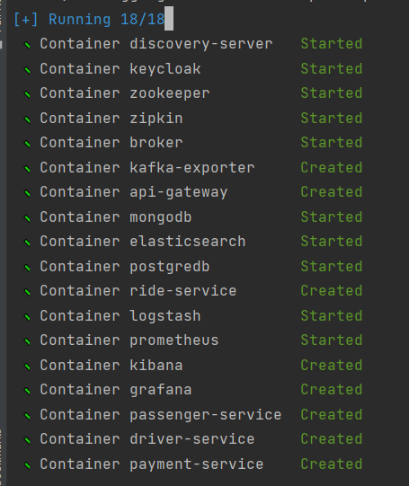
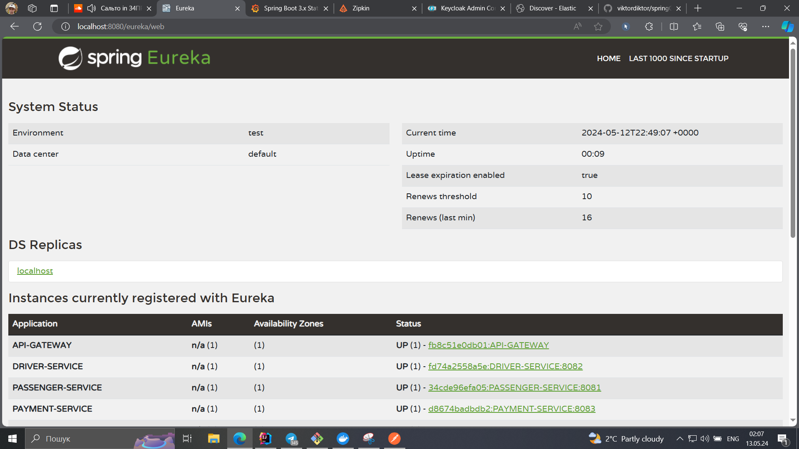
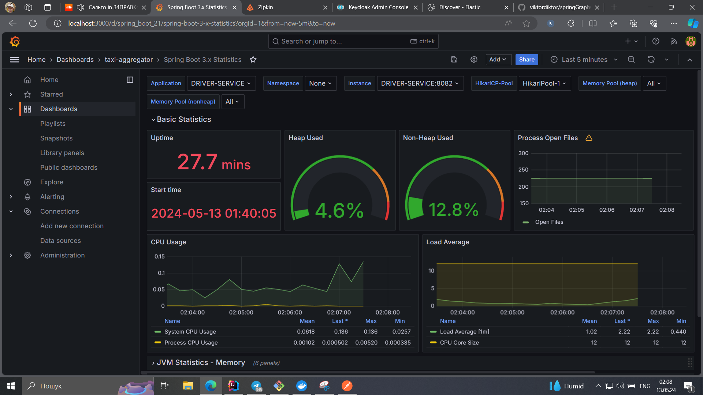
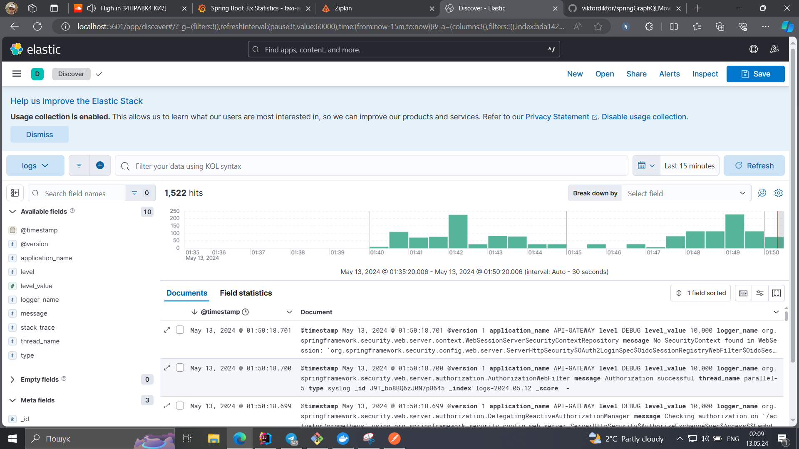
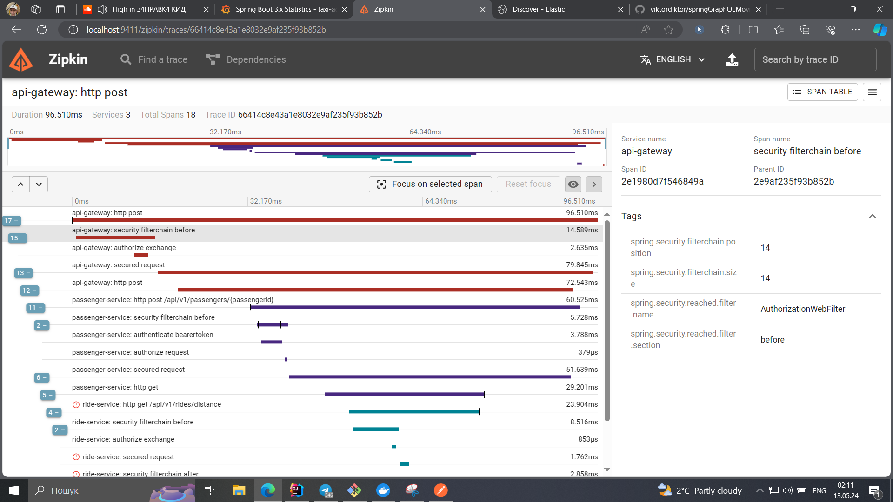
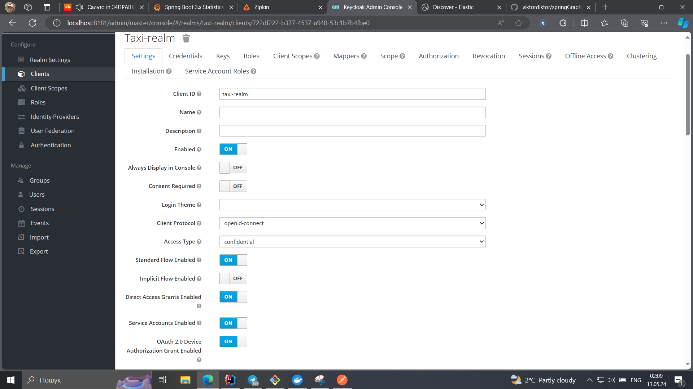

# Spring Microservice-Architecture *Taxi Aggregator API*

---  

**Stack**:
- Spring Boot
- Spring Cloud
- Spring Security
- Spring WebFlux (**feature/webflux** branch)
- PostgreSQL
- MongoDB
- WebClient, FeignClient
- Kafka
- Prometheus + Grafana
- ELK Stack
- Zipkin
- Keycloak
- Liquibase, Mongock
- jUnit, Mockito, TestContainers, Cucumber, RestAssured, Awaitility, StepVerifier
- Docker Compose

**Services**
- Passenger Service 
- Driver Service
- Payment Service (using *Stripe API*)
- Ride Service (using *Reactive Stack* in **feature/webflux** branch)
- Discovery Server
- Api Gateway

---

## Quick Start
#### Run app with the help of Docker Compose:

    docker-compose up -d

#### Stop application:

    docker stop $(docker ps -a -q)

---

## Eureka
You can see all Microservice Instances with the help of Eureka: *http://localhost:8080/eureka/web*

     You can also connect to Eureka by http://localhost:8761

---

## Prometheus + Grafana
With the help of Prometheus + Grafana you can analyze different dashboards: *http://localhost:3000*

    Currently there are 4 dashboards: JVM Micrometer, Spring Boot statistics, Resilience4j Dashboard, Kafka Dashboard

---

## ELK Stack
You can analyze logs and find queries with the help of ElasticSearch, Logstash and Kibana: *http://localhost:5601*

    You can learn more about ELK Stack: https://www.elastic.co/elastic-stack

---

## Zipkin
Use Zipkin if you want to trace your requests: *http://localhost:9411*

    Using of Zipkin is very useful with ELK (you can find logs with the help of Zipkin Trace ID and Kibana Query Language)

---

## Keycloak
You can configure security editing taxi-realm: *http://localhost:8181*

---

